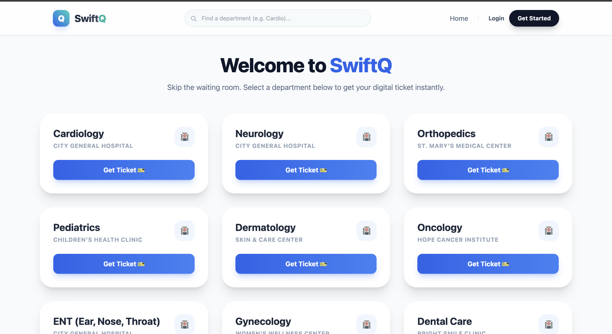
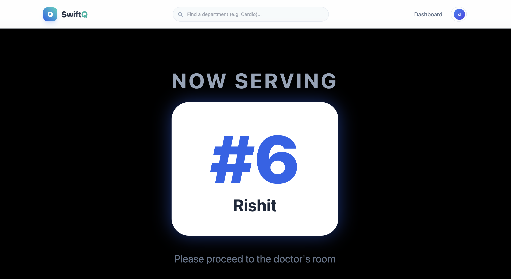

# 🏥 SwiftQ - Smart Hospital Queue Management System

 
**SwiftQ** is a full-stack real-time application designed to streamline hospital waiting rooms. It allows patients to join queues remotely, track their live status, and enables doctors to manage appointments efficiently through a digital dashboard.

## 🚀 Live Demo
- **Frontend (Vercel):** [https://swift-q.vercel.app](https://swift-q.vercel.app)
- **Backend (Render):** [https://swift-q.onrender.com](https://swift-q.onrender.com)

---

## ✨ Key Features

### 🧑‍🤝‍🧑 **For Patients**
* **Remote Queue Joining:** Select a department (e.g., Cardiology, General) and get a digital ticket instantly.
* **Real-Time Tracking:** Watch your queue position update live without refreshing the page.
* **Status Updates:** Visual indicators for "Waiting," "Serving," and "Completed."

### 👨‍⚕️ **For Doctors / Admins**
* **Admin Dashboard:** View the full list of waiting patients for specific departments.
* **Queue Control:** "Call Next" button instantly updates the queue and notifies the patient.
* **Patient Management:** Mark tickets as completed or skipped.

### 📺 **TV Display Mode (New!)**
* **Big Screen View:** A dedicated, high-contrast page designed for hospital waiting room monitors.
* **Instant Sync:** Updates immediately when a doctor clicks "Call Next" (powered by Socket.io).
* **Audio/Visual Cues:** Large text and animations to alert the next patient.

---

## 🛠️ Tech Stack

**Frontend:**
* React.js (Vite)
* Tailwind CSS (Styling & Animations)
* React Router DOM (Navigation)
* Axios (API Requests)

**Backend:**
* Node.js & Express.js
* MongoDB Atlas (Cloud Database)
* Socket.io (Real-time bi-directional communication)

**Deployment:**
* **Client:** Vercel (with custom routing configuration)
* **Server:** Render (handling dynamic ports & CORS)

---

## 📸 Screenshots

## 📸 Screenshots

| Home Page | Admin / Dashboard |
|-----------|-------------------|
|  |  |

| Tv Display | Mobile View |
|------------------|-------------|
|  |  |

## 👨‍💻 About Me
**Rishit Goswami** *Full-Stack Developer*

“I’m a developer who’s deeply passionate about backend engineering. While frontend shows the beauty of an application, what excites me more is the logic that powers it — how data is processed, how systems communicate, and how everything works reliably behind the scenes. I enjoy understanding and implementing the core mechanics that make applications function at scale.”

📫 **Let's Connect:**
- [GitHub](https://github.com/Rishit110305)

# 📫 Contact
If you have feedback or suggestions, feel free to connect with me.

Developer: Rishit Goswami
Gmail : rishitgoswami3740@gmail.com

